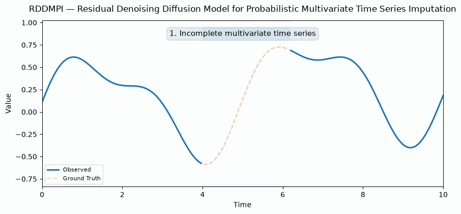

# RDDMPI: Residual Denoising Diffusion Model for Probabilistic Multivariate Time Series Imputation

[//]: # (<p align="center">)

[//]: # (  <b>Accepted at the Structured Probabilistic Inference & Generative Modeling &#40;SPIGM&#41; Workshop @ ICML 2026</b>)

[//]: # (</p>)

<p align="center">
  Ramiro Valdes Jara · David Chapman · Adam Meyers
</p>

RDDMPI is a probabilistic framework for **multivariate time series imputation** that combines a deterministic imputation model with a residual diffusion model. Instead of asking diffusion to reconstruct the entire missing signal from scratch, RDDMPI first obtains a strong deterministic estimate and then learns the remaining residual uncertainty around that estimate.

<p align="center">
  
</p>

<p align="center"><i>Conceptual illustration: a deterministic backbone first fills the missing interval; residual diffusion then generates multiple plausible corrections, yielding probabilistic imputations.</i></p>

---

## Method Overview

RDDMPI follows a two-stage approach to probabilistic time series imputation.

First, a deterministic backbone produces an initial reconstruction
$\hat{X}_{\mathrm{base}}$ of the missing values. Instead of applying diffusion
directly to the complete signal, RDDMPI models the remaining residual:

$$
R = X - \hat{X}_{\mathrm{base}}.
$$

A conditional diffusion model is trained to learn the distribution of these
residuals. At inference time, multiple residual samples $\hat{R}^{(s)}$ are
generated and added to the deterministic reconstruction:

$$
\hat{X}^{(s)} = \hat{X}_{\mathrm{base}} + \hat{R}^{(s)}.
$$

This decomposition allows the deterministic model to capture the main signal
structure while the diffusion model focuses on the remaining uncertainty,
producing multiple plausible imputations instead of a single deterministic
estimate.

---

## Installation

Clone the repository and install the required packages:

```bash
git clone https://github.com/ramirovaldesjara/RDDMPI.git
cd RDDMPI
pip install -r requirements.txt
```

---

## Data Preparation

Download all datasets needed from the following Google Drive folder: 

https://drive.google.com/drive/folders/13Cg1KYOlzM5C7K8gK8NfC-F3EYxkM3D2

The main experiments use:

- ETTh1
- ETTh2
- Exchange
- Illness
- Weather


## Model Implementation

The main RDDMPI implementation is located in:

```text
pypots_lib/nn/modules/RDDMPI/backbone.py
pypots_lib/nn/modules/RDDMPI/layers.py
```

The backbone handles the residual diffusion process and sampling, while the RDDMPI layers implement the diffusion network and conditioning components.

---

## Running Experiments

To run all experiments, use the script:

`run_all_exps.py`

In this file, you can control which datasets and models are included or excluded by modifying the following variables:

```python
INCLUDE_DATASETS = {"ETTh1", "ETTh2", "exchange", "illness", "weather"}
INCLUDE_MODELS = {"T1","RDDMPI", "CSDI", "DLinear", "ModernTCN", "iTransformer", "SAITS", "ImputeFormer", "TimesNet", "GPVAE", "FGTI"}
```
---

## Configuration

All experiment configurations are located in the directory:

`lab/configs/imputation_pypots/`

Unless otherwise specified, experiments are run with:
- **Training epochs:** `300`
- **Early stopping patience:** `30`
- **Number of runs (itr):** `5`
Dataset- and model-specific settings can be changed directly in the corresponding YAML configuration files.

---

## Repository Structure

```text
RDDMPI/
├── data_provider/                   # Dataset loading and preprocessing
├── exp/                             # Experiment logic
├── lab/configs/imputation_pypots/   # Dataset/model configurations
├── pypots_lib/
│   └── nn/modules/RDDMPI/           # RDDMPI backbone and diffusion layers
├── utils/                           # Utilities
├── run_all_exps.py                  # Run multiple experiments
├── run_exp.py                       # Run individual experiments
├── requirements.txt
└── README.md
```

---

## Acknowledgements

This repository builds on and adapts components from several excellent open-source time series projects. We thank their authors for making their implementations publicly available.

- [PyPOTS](https://github.com/WenjieDu/PyPOTS) 
- [CSDI](https://github.com/ermongroup/CSDI)
- [Time-Series-Library](https://github.com/thuml/Time-Series-Library) 
- [T1](https://github.com/Oppenheimerdinger/T1)
---

